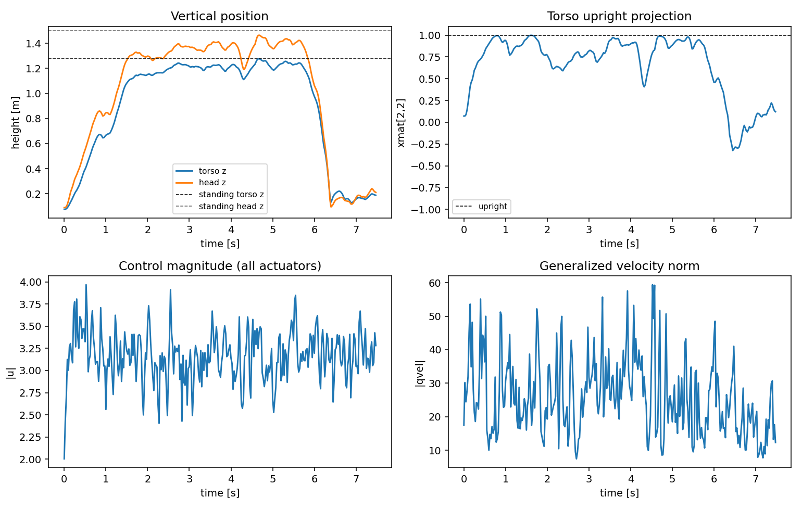
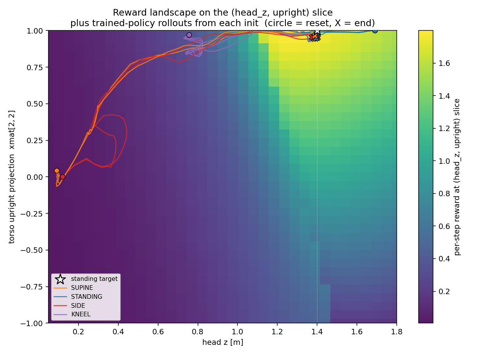

# controls_playground

Humanoid standup from arbitrary pose. A single brax PPO policy lifts a 21-DOF
dm_control humanoid to standing from supine, prone, side, kneeling, or
already-standing init. Includes an MPPI baseline for comparison.

## Rollouts

16 episodes, uniform sampling across the 5 init types. Each clip is ~8 s of
the same policy reacting to whichever pose it spawns in.

<table>
  <tr>
    <td><video src="https://github.com/user-attachments/assets/bec7e25a-2e25-4a43-9da0-b488ab24ef2a" width="260" controls autoplay loop muted playsinline></video></td>
    <td><video src="https://github.com/user-attachments/assets/7a96ff17-0a2c-4617-ae03-9a00669b2a48" width="260" controls autoplay loop muted playsinline></video></td>
    <td><video src="https://github.com/user-attachments/assets/50d5a89d-95e2-4c6f-8d93-330a71da87e1" width="260" controls autoplay loop muted playsinline></video></td>
    <td><video src="https://github.com/user-attachments/assets/ee2f31a9-95c2-44af-826e-8d9909a603a9" width="260" controls autoplay loop muted playsinline></video></td>
  </tr>
  <tr>
    <td><video src="https://github.com/user-attachments/assets/08955e30-3721-43a8-b426-6c35d8d52886" width="260" controls autoplay loop muted playsinline></video></td>
    <td><video src="https://github.com/user-attachments/assets/e5a0b907-880c-4843-b01c-0161a58d7c83" width="260" controls autoplay loop muted playsinline></video></td>
    <td><video src="https://github.com/user-attachments/assets/51509a25-489f-444e-8ff3-c230e28c3bdc" width="260" controls autoplay loop muted playsinline></video></td>
    <td><video src="https://github.com/user-attachments/assets/0d1d280f-3a40-4abd-ac25-ce9eef042c1a" width="260" controls autoplay loop muted playsinline></video></td>
  </tr>
  <tr>
    <td><video src="https://github.com/user-attachments/assets/6a5fd2de-81ca-41fd-98df-a87d089c8b9d" width="260" controls autoplay loop muted playsinline></video></td>
    <td><video src="https://github.com/user-attachments/assets/0431f35a-4cc8-4912-b6c1-282ef4078f6c" width="260" controls autoplay loop muted playsinline></video></td>
    <td><video src="https://github.com/user-attachments/assets/f7429ebc-81ac-493c-93e2-9b38e364f031" width="260" controls autoplay loop muted playsinline></video></td>
    <td><video src="https://github.com/user-attachments/assets/a41f90ad-2a40-4a6f-82c8-55e9a1aa3497" width="260" controls autoplay loop muted playsinline></video></td>
  </tr>
  <tr>
    <td><video src="https://github.com/user-attachments/assets/dfe9ca49-1cf5-42bd-9150-80045d339982" width="260" controls autoplay loop muted playsinline></video></td>
    <td><video src="https://github.com/user-attachments/assets/a6b40ad7-59f9-4d06-937e-87e78eed817a" width="260" controls autoplay loop muted playsinline></video></td>
    <td><video src="https://github.com/user-attachments/assets/456cb55d-40ad-4937-8227-998bf244557e" width="260" controls autoplay loop muted playsinline></video></td>
    <td><video src="https://github.com/user-attachments/assets/48fd8b2a-5a6f-469b-a0c7-87823d287273" width="260" controls autoplay loop muted playsinline></video></td>
  </tr>
</table>

Regenerate with:
```bash
cp-clips --ckpt checkpoints/humanoid_getup/getup-v8-long/ckpt_000412876800.pkl \
         --out-dir clips/v8-long-413M --episodes 16
```

## Install

```bash
uv venv .venv && source .venv/bin/activate
uv pip install -e .                  # local dev (CPU)
uv pip install -e ".[modal]"         # add Modal for H100 dispatch
uv pip install -e ".[modal,dev]"     # + pytest
```

GPU training uses the `playground==0.2.0` lockfile versions on Modal (see
`modal_dispatch.py`); for local viewing on macOS, install from
`mujoco_playground`'s `uv.lock` instead - see [mjpython note](#viewing-mjpython-quirk).

## Layout

```
configs/
  env.yaml          init anchors + reward weights + jitter
  train.yaml        PPO + network + modal settings
  mpc.yaml          MPPI horizon / cost weights / model path
src/controls_playground/
  config.py         yaml -> attribute-access namespace
  env.py            HumanoidGetUp env (consumes configs/env.yaml)
  policy.py         brax PPO checkpoint loader (auto-detects hidden sizes)
  train.py          training loop (cp-train)
  viz.py            interactive viewer (cp-play) + mp4 renderer (cp-render)
  probe.py          OOD probe with wider init jitter (cp-probe)
  mpc.py            MPPI plan/replay baseline (cp-mpc plan|replay)
modal_dispatch.py   H100 dispatcher (modal run modal_dispatch.py ...)
assets/humanoid/    MuJoCo XML used by the MPC baseline (carries "supine" key)
tests/test_smoke.py minimal env + config tests
WRITEUP.md          approach, diagnostic journey, results, limitations
```

## CLI

Console scripts are installed by `pip install -e .` (see `pyproject.toml`):

```bash
cp-train  --config configs/train.yaml --run-name my-run
cp-play   --ckpt checkpoints/humanoid_getup/my-run/final.pkl
cp-render --ckpt checkpoints/humanoid_getup/my-run/final.pkl --out rollout.mp4
cp-probe  --ckpt checkpoints/humanoid_getup/my-run/final.pkl
cp-mpc    plan   --config configs/mpc.yaml --out mpc_reference.npz
cp-mpc    replay --traj mpc_reference.npz
```

Each command takes `--config` (or `--env-config`) flags to point at alternate
YAMLs without editing code. Module-style invocation also works:
`python -m controls_playground.train --config configs/train.yaml`.

## Training on Modal H100

```bash
# Requires the `wandb-secret` Modal secret with WANDB_API_KEY.
modal run modal_dispatch.py --num-timesteps 200000000 --run-name my-run
```

Checkpoints land in Modal volume `controls-ckpts` at
`/humanoid_getup/<run_name>/`:
- `latest.pkl` overwritten per eval
- `ckpt_<step>.pkl` snapshots per eval
- `final.pkl` last

A 200M-step run on H100 is ~15 min and costs roughly $1 of GPU time.

## Render rollouts to mp4 (on Modal)

```bash
modal run modal_dispatch.py --module controls_playground.viz \
  --extra "--ckpt /root/work/humanoid_getup/my-run/final.pkl"
```

Output mp4 lands beside the checkpoint in the volume. Download via the
Modal storage web UI (the CLI has an SSL issue on macOS for `volume get`).

## Viewing (mjpython quirk)

On macOS, `mujoco.viewer.launch_passive` requires `mjpython` (ships with the
`mujoco` package) and the host Python's dylib on `DYLD_LIBRARY_PATH`:

```bash
DYLD_LIBRARY_PATH=$HOME/.local/share/uv/python/cpython-3.11.14-macos-aarch64-none/lib \
  $(python -c "import mujoco, os; print(os.path.join(os.path.dirname(mujoco.__file__), '..', '..', '..', 'bin', 'mjpython'))") \
  -m controls_playground.viz --ckpt checkpoints/.../final.pkl
```

On Linux, just `cp-play --ckpt ...` works.

## MPC baseline (no training)

Offline MPPI / predictive sampling on the bundled humanoid XML
(`assets/humanoid/humanoid.xml`, which carries a `supine` keyframe). Solves
only the supine-to-standing case; the cost has no notion of multi-pose init.
Included as a single-condition reference: what an optimization-based
controller produces with the same observation budget, no learning required.

```bash
cp-mpc plan   --config configs/mpc.yaml --out mpc_reference.npz   # ~2-3 min CPU
cp-mpc replay --traj mpc_reference.npz                            # visualize
cp-analysis   --render                                            # plots + mp4
```

`cp-analysis` produces `analysis_out/mpc_trajectory.png` (4-panel time
series of head/torso height, upright projection, control magnitude, qvel
norm) and `mpc_rollout.{mp4,gif}` from the saved trajectory.




See `WRITEUP.md` §5c for the MPPI math and §5c's empirical state-landscape
plot showing the trained policy's trajectories overlaid on the reward
field.

## Empirical state landscape (`cp-landscape`)

```bash
cp-landscape --ckpt checkpoints/humanoid_getup/<run>/final.pkl \
             --out analysis_out/landscape.png
```

Projects the 54-D state onto the two task-relevant scalars
$(h_{\text{head}}, \mathrm{xmat}_{\text{torso}}[2,2])$ and overlays
trained-policy rollouts on top of a reward heatmap. The empirical analog
of an "invariant set" / "feasible region" for this nonlinear, high-D,
contact-rich system.



## Tests

```bash
pytest tests/
```

The smoke tests verify the env constructs, reset/step are NaN-free, the
config loader round-trips, and all 5 init poses are reachable.
