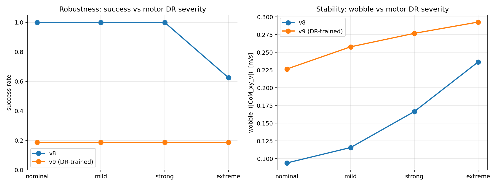

# Humanoid Standup from Arbitrary Pose

## 1. Problem

For the mujoco humanoid, the standing balance problem is a well-trodden path. Balance is a local problem: linearize about the upright equilibrium, compute an LQR or PD gain, and the controller is done. Getup is global. The body must traverse mechanically distinct phases (lying, sitting, kneeling, partial squat, standing), almost none of which sit near an equilibrium of the unforced dynamics, and each phase requires a different motion primitive: sit-up from supine, push-up from prone, side-roll, leg extension. The reward signal is also sparse. Head height and torso-upright are flat across most of the configuration space the policy must cross, and meaningful reward exists only in a thin slice of fully-standing posture.

The take-home spec adds two further constraints: a *single* policy must recover from face-up, face-down, and on-side orientations (qualitatively different first moves), and the standing pose must be *actively stabilized* (8 unstable modes in the local linearization at the operating point) rather than merely reached and abandoned.

## 1a. Assumptions

- **5 anchor poses cover the random initial pose.** Uniform mix
  over {standing, supine, prone, side, kneel} plus ±0.02 rad joint
  jitter (probed up to ±0.3 rad + random yaw + 10 cm xy offset). Not a
  continuous distribution over arbitrary configurations - a randomly-
  twisted limbs-tangled start isn't in-distribution.
- **No physics-parameter Domain Rand.** Mass, inertia, friction, motor torque
  limits held at dm_control defaults. Motor-model DR is added in §5 as
  a separate evaluation. Lifted by standard DR if sim-to-real matters.
- **Not a real robot.** Fixed torque actuators, no
  per-joint PD or motor parameters to co-tune. Existing real-robot
  getup work (HumanUP, RSS 2025) jointly tunes motor parameters with
  the policy for exactly this reason.

---

## 2. Approach

A few approaches were attempted to try to give this a controls + RL flavor (Appendix C) each plateaued on a different reward-shape local minimum or hit the ~100-env CPU throughput wall. 

The switch to MJX + GPU made reward iteration tractable in a human-scale debug loop.

**Stack:** brax PPO (Google) + mujoco_playground dm_control humanoid (DeepMind), trained on Modal H100. Per-run compute ranged from ~90M env-steps to 1B.

**Robot:** 21-DOF dm_control humanoid (DeepMind's standard model), actuators on each hinge, freejoint root.

**Algorithm:** brax PPO with `HumanoidStand` defaults (`num_envs=2048`, `lr=1e-3`, $\gamma=0.995$, GAE-λ=0.95); network widened to `[512,256,128]`; 5-way init mix in `HumanoidGetUp`. §3 covers what each choice fixes.

---

## 3. Reward design (and how we got there)

The final reward is the sum of three terms

- the stock dm-control
multiplicative balance
- a dense head-height bonus
- a standing-stability gate:

$$
r(s,a) \;=\; r_{\text{stand}}\,r_{\text{move}}\,r_{\text{ctrl}} \;+\; 0.5\,e^{-(h-1.4)^2/0.49} \;+\; \mathbf{1}_{[h>1.3]}\big(0.15(R_l+R_r) - \|v^{xy}_{\text{com}}\|^2\big)
$$

with $h$ = head $z$, $R_{l/r}$ = feet vertical alignment, $v^{xy}_{\text{com}}$
= COM horizontal velocity. Each term was added in response to a specific
failure mode:

**1. The stock reward is zero from supine.**
First training NaN'd. The stock multiplicative reward saturates at 0 below
head_z=1.05, so all advantages were zero and PPO's entropy term blew up
actions until physics returned NaN qvel. Adding `clip(head_z/1.4)` fixed
the NaN but introduced reward hacking: the policy parked at a sitting
pose (head_z≈0.77 m) where the clip term saturated and the stock standing
term was still 0. Switching to a non-saturating exponential removed the
local optimum.

**2. The critic couldn't propagate value across the kneel→stand gap.**
Exp reward + 50/50 supine/standing mix produced real getup progress but
plateaued at kneeling-with-hand-support. Tightening the standing threshold
(in case kneeling was reward-comfortable) made things 36% worse without
changing qualitative behavior, confirming the plateau as a *critic
value-gradient* problem rather than a reward-shape one. The fix was a
5-way init mix {standing, supine, prone, side, kneel-snapshot}, where the
kneel-snapshot was lifted from the stuck rollout itself. Initing the
critic at the bottleneck pose gave it direct visibility into kneel→stand
transitions, propagating V(stand) backward via GAE through exactly the
gap. Network was widened in the same iteration from brax's ~50× undersized
default `[32]*4` to `[512, 256, 128]`. With both fixes `stand` jumped
189 → 500 → 695 over three evals.

**3. Longer training extended standing but introduced wobble.**
At 500M steps the policy reached standing reliably but stood on tippy-toes
and swayed. Two terms gated on head_z > 1.3 (foot-flat reward and a
stillness penalty on COM xy-velocity) target the wobble specifically.
The gate matters: ungated, these terms would compete with the getup phase
rather than shape the standing phase.

The deliverable is the v8-long 413M-step peak ckpt
(`getup-v8-long/ckpt_000412876800.pkl`), preserved via per-eval
checkpointing because the long run oscillated between high evals
(1460 reward) and partial collapses (~669); `final.pkl` landed on a trough.

---

## 4. Results

| | Stock (balance only) | v6 | v7 @530M | **v8-long @413M (peak)** |
|---|---|---|---|---|
| Init pose | Upright | 5-way | 5-way | 5-way |
| Train steps | 90M | 265M | 530M | 413M |
| total reward / ep | 810 | 1076 | 1177 | **1460** (peak) |
| `stand` / ep (max 1000) | ~810 | 695 | 820 | **868** (peak) |
| `foot_flat` / ep | - | ~41 | ~99 | **754** (7.5× v7) |
| `stillness` penalty / ep | - | 28 | 45 | 40 |
| eval std | low | ~30 | 143 | 97 |

v8-long oscillated between 1460 and ~669 in late evals; this row is the
413M peak ckpt, not `final.pkl` (which landed on a trough). v8 trades a
small amount of standing time for 7.5× better foot-flat (feet flatter,
not on tippy-toes) and 32% lower eval std, while peak stand reward still
beats v7.

Qualitative behavior
- Coordinated multi-stage getup motion. From supine: rolls slightly, sits up
  with arm push, brings legs under, pushes through kneeling, extends to stand.
- Different sequence for prone (push-up to all-fours → kneel → stand) and
  for side (roll → supine → standard sequence) - one policy, three motions.
- **Stable standing pose** with both feet flat on the floor. No tippy-toe.
  Minor sway to maintain balance but no falling.

### Generalization probe (out-of-distribution inits)

Trained jitter was ±0.02 rad with fixed quaternions per init type. The
`cp-probe` script tests under 15× wider joint jitter (±0.3 rad), random
yaw (±π), and ±10 cm xy offset. **10/10 stood**, peak head_z 1.48-1.73 m
across all 5 init types. n=10 is small. The Wilson 95% CI is [0.72, 1.00],
so plausibly above ~70% but no tighter than that. The pattern is at least
consistent with the policy generalizing beyond the trained init
distribution (the dm_control humanoid obs is yaw-invariant and the
multi-pose mix implicitly covers some joint variation), but a proper
validation would need n in the hundreds.

## 5. Controls extension

### Hybrid LQR + RL (negative result)

Motivation: kill the residual wobble in the standing phase. The RL policy
is a tanh-MLP - its output near the standing pose is not perfectly smooth
in the observation, so small contact-noise perturbations cause action
twitches that the policy then has to recover from. A classical linear
controller around the standing pose would, in principle, give a smooth
state-feedback that doesn't twitch. Note: this humanoid has no true
unforced equilibrium at the standing pose (the body falls under zero
control); we therefore linearize about the policy's *empirical operating
point* during standing instead of a strict equilibrium. Same idea as
gain-scheduling around a quasi-steady operating regime.

**Design.** Linearize at the policy's empirical operating point during
standing (lowest-velocity standing state in a v8 STANDING-init rollout)
via `mjd_transitionFD`; solve the discrete ARE for $K$. Open-loop: 8 of
54 eigenvalues outside the unit circle (max $|\lambda(A)| = 1.043$).
Closed-loop: max $|\lambda(A-BK)| = 0.9999$, marginally stable on
the unit circle and not strictly inside. The linear analysis says
"borderline stabilizable," not "robustly stabilized."

**Three closed-loop modes were tried** on top of the trained v8 policy
(no retraining): hard switch to LQR inside the standing region, additive
$u = u_{RL} + \alpha(-Ke)$ with smooth gating, and velocity-feedback only
$u = u_{RL} - \alpha K_v \dot q$. All three underperformed RL-only
(wobble 0.098 at n=16): switch and additive were ~60% worse (0.166);
velocity-damping was at best marginal at small $\alpha$ (8% improvement
at $\alpha=0.05$, within noise) and grew worse at larger $\alpha$.

### Motor-model domain randomization (positive result)

Motivation: the trained policy uses fixed dm_control actuator dynamics.
A real robot's motors have unit-to-unit variation in gain, response lag,
and torque limits. How robust is the trained policy to motor-model
mismatch?

**Setup.** Per-joint gain $g$, first-order lag time-constant $\tau$, and
saturation $u_{\max}$ applied to the policy's commanded action before it
reaches the simulator; sampled once per episode from uniform ranges and
hidden from the policy (`MotorDRHumanoidGetUp` wrapper). Sweep over four
severity tiers (nominal / mild ±15% / strong ±30% / extreme ±50% gain;
$\tau$ from 5 ms baseline to 5–80 ms; $u_{\max}$ ±20–60%). Per-tier
n=20 episodes, v8 policy with no DR in training.

The trained v8 policy keeps a 100% success rate up to $\pm 30\%$ motor
variation, while its wobble grows substantially (0.094 → 0.166, +77%) - the
*task* still succeeds but the standing quality degrades meaningfully on
the way. At $\pm 50\%$ (extreme), success drops by 38 percentage points in
a single severity step (100% → 62%) and wobble grows another 42%; side-init
is the worst case at 40% success.

---

## 6. Limitations & Future Work

### Where the policy fails

The policy reaches stable upright but doesn't *maintain* it indefinitely.
Observed pattern: stands → loses balance (often via tippy-toe foot) → falls
to knees or fully supine → re-executes the getup → stands again. The cycle
gets reward (head_bonus fires throughout) but isn't true sustained balance.

### What would close the remaining gap (easiest wins first)

1. **Termination on fallen state.** If head_z < 0.3 for >50 consecutive
   steps, end the episode (no penalty, just truncate).
2. **Learning-rate decay** in the last 30% of training, to lock in a
   good basin rather than letting a constant lr keep the policy moving.
3. **State-init curriculum decay** (mix probability shrinks toward 0%
   standing as the policy improves). We used a fixed uniform mix; the
   standard recipe in getup literature anneals it.
4. **Short reference for kneel→stand**: a 50-frame interpolated reference
   trajectory used as an additional tracking reward only in the
   transition zone. Most reliable fix, most engineering cost.
5. **Drag-assist:** a virtual upward force on the head, decayed over
   training.

---

## 7. References and AI assistance

**Reference material:** HumanUP (Dong et al., *Learning Getting-Up
Policies for Real-World Humanoid Robots*, RSS 2025) for the state-init-mix
and exponential-reward ideas. That work targets a different system
(Unitree G1 with co-optimized motor parameters and Isaac Gym) and a
heavier two-stage recipe (drag-assist, Stage I discovery → Stage II
tracking). I adopted only the two ideas above and validated each in
isolation; the rest of the recipe was out of scope (see Appendix C).

**AI assistance:** I worked with an AI coding assistant (Claude) on
boilerplate (Modal image, plot scripts, argparse, YAML loader, package
restructure), mechanical debugging (e.g., the brax PPO
`num_envs × unroll_length` divisibility constraint that produced NaN in
v1), and the per-episode clip renderer. Engineering decisions, diagnoses,
and the final calls were mine.

## Appendix A: PPO formulation

State $s \in \mathbb{R}^{67}$ (joint angles, joint velocities, head height,
end-effector positions in torso frame, torso vertical, CoM velocity).
Action $a \in [-1,1]^{21}$ (joint torque commands).

**Init distribution.**

$$
\rho_0(q_0)  =  \tfrac{1}{5}\sum_{i \in \mathcal{I}} \delta\big(q_0 - \bar q^{(i)}\big)  \ast  \mathcal{U}\left([-\epsilon_j, \epsilon_j]^{n_j}\right),
\quad \mathcal{I} = \{\text{stand, supine, prone, side, kneel}\}
$$

with $\epsilon_j = 0.02$ rad and $\bar q^{(\text{kneel})}$ a snapshot
from a partial-getup rollout.

**Reward weights** (for the equation in §3): $r_{\text{stand}}(s) = \mathrm{tol}(h, [1.4,\infty), 0.1) \cdot \mathrm{tol}(\hat z_{\text{torso}}, [0.9,\infty), m')$,
$w_h = 0.5$, $\sigma_h = 0.7$, $w_{\text{ff}} = 0.3$, $w_{\text{st}} = 1.0$,
$h_{\min} = 1.3$ m.

**Hyperparameters (brax `HumanoidStand` defaults except network).** Gaussian
policy with state-dependent mean and global log-std; MLPs $(512,256,128)$
tanh for both $\mu_\theta$ and $V_\phi$. $\gamma = 0.995$,
$\lambda_{\text{GAE}} = 0.95$, $\epsilon_{\text{clip}} = 0.2$, lr $10^{-3}$,
2048 envs, unroll length 30, batch 1024, 32 minibatches × 16 epochs per
outer step. v8-long budget: $5 \times 10^8$ env steps.

Standard PPO clipped surrogate + value loss + entropy bonus with GAE-λ
advantages; see `src/controls_playground/scripts/train.py` for the call
into `brax.training.agents.ppo.train`.

---

## Appendix B: Empirical state landscape

The 54-D nonlinear contact dynamics doesn't admit an analytic "feasible
region" (the way a 2-D LTI system does), so we project onto the two
task-relevant scalars $(h, \hat z_{\text{torso}} = \mathrm{xmat}[2,2])$ -
head height and torso-up alignment - and overlay:
- a heatmap of the per-step reward on a synthetic grid over that slice,
- trajectories of the trained policy from each init type.

The standing target corner is $(h, \hat z_{\text{torso}}) = (1.4, 1.0)$.

---

## Appendix C : Prior approaches (and why they were abandoned)

Before settling on the brax PPO + mujoco_playground setup used here, four
other approaches were tried on a CPU MuJoCo + multiprocessing prototype.
None converged on a usable controller within a reasonable wall-clock; each
plateaued on a different local minimum that the reward shape permitted.
The common bottleneck was env throughput, which is what motivated the
switch to MJX + GPU.

### (a) PPO from scratch (single-pose supine)

A from-scratch PPO actor-critic on a single supine init, with a dense
head-height reward and no reference. The policy discovered "standing on
head": it could maximize torso z by inverting onto its head/shoulders
with legs sticking up. Head reward fired hard, standing reward stayed
at zero, the body never touched its feet to the floor. The dense reward
just rewarded "torso high" without distinguishing "on feet" from "on
head". Separately, the multiprocessing vector env topped out at ~100
concurrent CPU MuJoCo envs, so PPO sample efficiency at that scale meant
hours per real reward jump; full standing would have taken days even
with the reward shape fixed.

### (b) MPPI offline planning

Pure predictive sampling from the supine keyframe, stitched in two
stages: a **rise** phase (MPPI with a height + upright cost driving the
torso up) followed by a **settle** phase (MPPI with a state-tracking
cost to bring `|qvel|` to zero at standing - needed because the rise
phase arrived at standing *with momentum* and otherwise fell straight
through it).

The rise-only planner consistently produced a "leap-through" trajectory,
peak torso z ~1.25 m then collapse, because reaching standing was cheap
but staying there required a separate velocity-damping cost the rise
phase didn't have. The two-stage stitch was the fix. Strength: no
training, demonstrates the dynamics support the motion under bounded
torque. Weakness: one trajectory, one init condition. Open-loop ctrl
replay diverges in seconds under contact noise, and closed-loop
replanning every step is too slow for real-time.

The cleaned port of this MPC ships here as `cp-mpc` (cost in `configs/mpc.yaml`, implementation in `src/controls_playground/scripts/mpc.py`).

### (c) MPPI + learned residual

A residual policy: action $= u_{\text{MPPI}}(t) + \pi_\theta(s)$, where
$u_{\text{MPPI}}$ is the open-loop ctrl from (b)'s saved trajectory and
$\pi_\theta$ is a small MLP trained with PPO to add corrections. Reward
combined tracking the MPPI joint trajectory with the standing terms.

The residual collapsed to ~zero output. The MPPI feed-forward was strong
enough to mostly succeed, and the residual couldn't improve tracking
error without breaking the timing alignment, so PPO learned the safest
policy: do nothing extra. The controller's behavior was just the MPPI
trajectory, with all its fragility. Residual policies need the base
controller to be bad enough that corrections clearly help; a near-perfect
MPPI baseline removes the gradient.

### (d) PPO tracking the MPPI trajectory (no residual)

Drop the residual idea, train PPO from scratch with a dense reward that
*tracks* the MPPI joint trajectory: $r \propto -\|q - q_{\text{ref}}(t)\|^2$
plus standing reward at the end. Phase-randomized reset so the agent
learns to recover from any point along the reference.

"Crouch with hands on floor": the policy discovered that mirroring the
MPPI joint angles approximately while keeping its hands on the ground
for support let it score most of the tracking reward without committing
to the actual standup. It shadowed the upper-body motion in a crouched,
hand-supported pose. Porting this env to MJX (vmap-batched on a single
H100, Newton solver since CG diverged from the MPPI reference's
contact-rich state distribution) was the first step out of the CPU
env-throughput wall; it scaled to 2048 envs and trained at ~2M
env-steps/sec. The tracking reward still locks the policy to one
reference trajectory shape, though. For the take-home spec (single
controller across face-up / face-down / on-side) a tracking policy
would need a library of reference trajectories, or it can just learn
the standup behavior end-to-end without tracking, which is what this
repo does.
